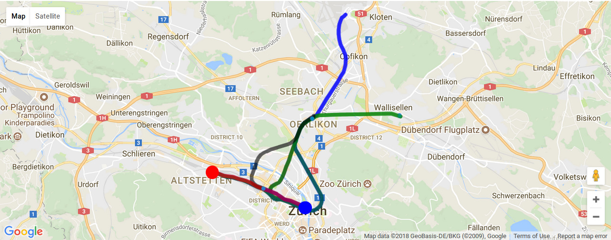
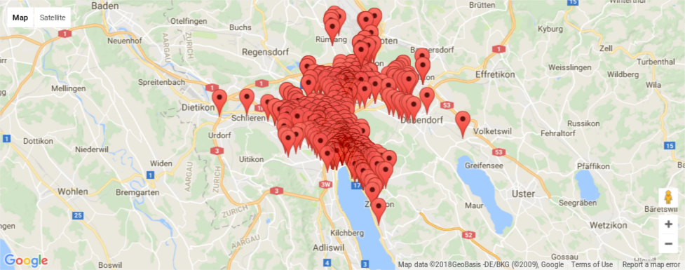
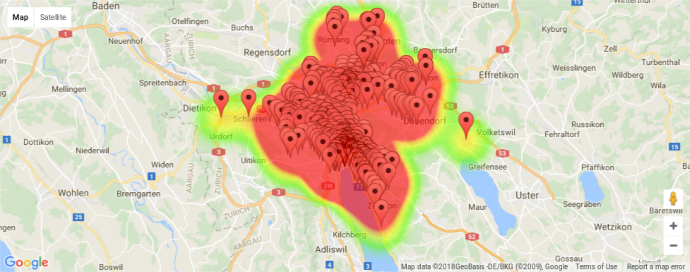
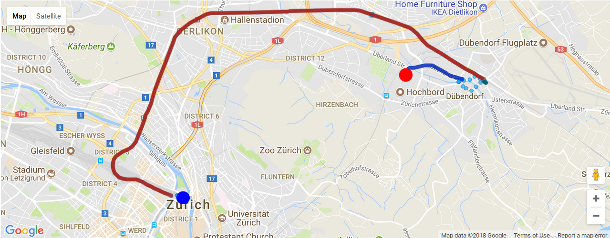

# DS Lab - Final Assignment: Robust Journey Planning
## This project was done by Dream Team: Xingce Bao, Sohyeong Kim, Guilio Masinelli, Silvio Zanoli
# Splendid routing algorithm with distribution of arriving time !

  

# Isochrone map with possibility of arriving !

  

# Also can be a heat map!

  

## Problem Motivation

Imagine you are a regular user of the public transport system, and you are checking the operator's schedule to meet your friends for a class reunion. The choices are:

1. You could leave in 10mins, and arrive with enough time to spare for gossips before the reunion starts.

2. You could leave now on a different route and arrive just in time for the reunion.

Undoubtedly, if this is the only information available, most of us will opt for 1.

If we now tell you that option 1 carries a fifty percent chance of missing a connection and be late for the reunion. Whereas, option 2 is almost guaranteed to take you there on time. Would you still consider option 1?

Probably not. However, most public transport applications will insist on the first option. This is because they are programmed to plan routes that offer the shortest travel times, without considering the risk factors.

In this project, we developed an algorithm that can build a isochrone map with risk factors , and also a routing algorithm with the distribution of arriving time!

So this algorithm is quite useful when you have a important affairs! For example, when you need to catch the plane, it is useful to make sure that you have a high possibility of arriving on time!

## Orienting through files
In order to have a better understanding of our work we decided to divide the the code we wrote in 5 indipendent files:

- Part   0: Here we perform a small pre-processing of the station-list file in order to get only the most significant stations (within 10 km from Zurich HB)
- Part   I: This is a Zeppelin notebook used to pre-process our data in order to obtain the list of public transport with only the fields that we need and cleaning some of the outliers (for example, broken trains).
- Part  II: Here we compute the final data-processing in order to eliminate all the outliers, and compute mean and variance for each train in each station at each time.
- Part III: Here we build the isochrone map and we compute the adjacency matrix for the train-stations.
- Part  IV: This is the final step, here we compute the optimal route from 2 stations.

Those explanation are just a guide on how to orient through this project folder, deeper explanation will be given hereafter and directly in the notebooks.
Every notebook is independent from the other once the processed dataset is included. It is possible to find the processed dataset at the following link: [Data](https://drive.google.com/drive/u/2/folders/1sCI2Am42jbNFm8k6JwffnOaYoJLQAG71)

## Dataset Description

For this project we will use the data published by the Open Data Platform Swiss Public Transport (<https://opentransportdata.swiss>).

For this project, we are using the actual data [istdaten](<https://opentransportdata.swiss/en/dataset/istdaten>) and the station list data [BFKOORD_GEO](https://opentransportdata.swiss/de/cookbook/hafas-rohdaten-format-hrdf/#Abgrenzung).

Format: the dataset is a collection of textfiles with fields separated by ';' (semi-colon). There is one file per day.

This is a brief explanation of the fields in the data.

- `BETRIEBSTAG`: date of the trip
- `FAHRT_BEZEICHNER`: identifies the trip
- `BETREIBER_ABK`, `BETREIBER_NAME`: operator (name will contain the full name, e.g. Schweizerische Bundesbahnen for SBB)
- `PRODUCT_ID`: type of transport, e.g. train, bus
- `LINIEN_ID`: for trains, this is the train number
- `LINIEN_TEXT`,`VERKEHRSMITTEL_TEXT`: for trains, the service type (IC, IR, RE, etc.)
- `ZUSATZFAHRT_TF`: boolean, true if this is an additional trip (not part of the regular schedule)
- `FAELLT_AUS_TF`: boolean, true if this trip failed (cancelled or not completed)
- `HALTESTELLEN_NAME`: name of the stop
- `BPUIC`: id of the station
- `ANKUNFTSZEIT`: arrival time at the stop according to schedule
- `AN_PROGNOSE`: actual arrival time (when `AN_PROGNOSE_STATUS` is `GESCHAETZT`)
- `AN_PROGNOSE_STATUS`: look only at lines when this is `GESCHAETZT`. This indicates that `AN_PROGNOSE` is the measured time of arrival.
- `ABFAHRTSZEIT`: departure time at the stop according to schedule
- `AB_PROGNOSE`: actual departure time (when `AN_PROGNOSE_STATUS` is `GESCHAETZT`)
- `AB_PROGNOSE_STATUS`: look only at lines when this is `GESCHAETZT`. This indicates that `AB_PROGNOSE` is the measured time of arrival.
- `DURCHFAHRT_TF`: boolean, true if the transport does not stop there

`AN_PROGNOSE_STATUS` and `AB_PROGNOSE_STATUS` is `UNBEKANNT` when no actual time exists. However, sometimes `UNBEKANNT` is missing even if there were no actual time.
In some cases, several duplicated data is stored for a same journey. Therefore, it is necessary to sanitize the dataset before processing. 

We will use the SBB data limited around the Zürich area. We will focus on all the stops within 10km from the Zürich HB train station.

## Model of Delay

As a common sense, the train never arrives early. So we use a gamma distribution to model the departing time and the arriving time of the train. 
The gamma distribution has a probability denstity function like this:

  

As we can see, the gamma functions has two parameters, the $`k`$ and the $`\theta`$ . 
The mean of the gamma distribution is $`k \theta`$, and the variance of the gamma distribution is $k \theta^2$.

PDF of gamma distribution :
 , where $`x \in (0, \infty)`$

So in the dataset, we just compute the mean and the varicance of the data as an estimation of the mean and the variance of the distribution.
And then, we can use the mean and the variance to compute the parameter $`k`$ and $`\theta`$.

After having the parameter of the gamma distribution, the question is:

Suppose we have two random variables X and Y which are drawn from two different gamma distributions, how we can compute $`\mathbb{P}(X<Y)`$?

It can be seen that this problem has no analytic solution when the parameter $`\theta`$ of the two distributions are different.

So in our program, the MC simulation is used to solve this problem. 
1000 points from two distributions are drawn respectively and we count the number that satisfies $`X<Y`$ and we use the frequency to estimate the possibility.

## Isochrone Map Build

  

  <em>(Above) Full transfer case with parameter of date = '08.01.2018 11:55:00', time = 1200, probability =0.9</em>

When we build the isochrone map, we take the departure station and do a breadth-first-search to find stations that can be reached until the time slot expires!

When building the graph, a probability threshold is set by the user. So when computing the transfer, only the transfer which satisfies the probability constraint is taken into account. 
Even the transfer considers the risk factor which gives a very robust results!

The difficulty of this algorithm is that for some stations, it may be passed by different trains for many times, which adds a lot of extra computation. 
What we implement here is when we pass a same station twice, we compute the probability wheather this arrival is later than the previous.
If the probability is higher than the threshold, then we do not pass this station again!

The advantages of the breadth-first-search is that usually, the less transfers there are, the faster the routing is. 
So with a high probability, the first pass of the station is the best. Additionally, it increases the efficiency of the computation.

## Finding optimal travel(Routing)

  

  <em>(Above) Suggested routes from our algorithm from `Zürich HB` to  `Zurich Dübendorf, Hochbord Nord`,  date  = '21.05.2018 16:15:00', probability =0.9</em>

In order to find an optimal travel between two stations we compute an adjacent matrix that tells us if two stations are connected wth a direct transfer 
(direct transfer = a trip between two stations without changes or that can be reached directly by walking).

This matrix is then used to find all possible travels from one station to another: at first we search for a direct connection 
and then we increase the number of possible transfers up to a limit (for example, a maximum of 4 changes). 
From this algoritm we get a list of possible routes, the only remaining thing is to choose the fastest five ones with respect to a confidence interval which the user can set.

## Visualization 
In the visualization part, we visualized our results of isochrone map and the routing. We used the gmaps library to show google maps in the Jupyter notebook. 
The example results are shown in the previous parts respectively.

Since the gmaps library is mostly designed for javascript, the Python API is really limited. 
We have to change the source code of the gmaps to achieve our visualization. 
So if you want to redisplay our results, **Do not use pip or conda to install gmaps. You need to change the source code as the instructions in INSTALLGMAPS.md**

In case you want to see the results directly, we put the static images in the comment blocks of jupyter notebooks to let you have a brief view.

For Isochrone Map we visualize by ploting every station that can be reached within a time interval and satisfy the probability constraint. 
If you click on markers that identifies the stations, it will show the information about station as well as the probability that you can arrive there. 

For routing algorithm, we visualize using google map Directions data. We compute the station we need to pass and let google to fill the railways or bus routes automatically.
This is why we need to change a little bit of the source code of the gmaps. It is more beautiful than only providing straight lines between the stations!

## Discussion
Pros:
- The algorithm we designed both for routing and isochrone map is agnostic to the departing station hence we're not forced to start from Zurich HB.
- Cleaned dataset divided into 7 days to ensure a easier computation and modularity.
- Modularity is ensured: changing in the dataset only require to recompute the distributions, adding special days only require to load them and compute mean and variance.

Cons:
- The algorithm to compute the isochrone map could be slow due to the exponential nature of the recursive algorithm upon it was built.
- Heavily relying on GoogleMaps for visualization: nowadays is a fast-changing enviroment which is turning to a paid service.
- Not taking into account "bank holidays".

Possible improvements:
- For the moment we only take into account, for walking, stations in a radius of 100 meters from the arrival point, it's possible to improve this by putting no-limits in the distance we can walk and optimize over it.
- The current used PDF (the gamma function) is a first guess, it can be improved with different models, for example, a Poisson distribution.
- It's possible to implement a live-version using streaming data in order to compute the distribution over a moving time window.

## References

* Adi Botea, Stefano Braghin, "Contingent versus Deterministic Plans in Multi-Modal Journey Planning". ICAPS 2015: 268-272.
* Adi Botea, Evdokia Nikolova, Michele Berlingerio, "Multi-Modal Journey Planning in the Presence of Uncertainty". ICAPS 2013.
* S Gao, I Chabini, "Optimal routing policy problems in stochastic time-dependent networks", Transportation Research Part B: Methodological, 2006.

